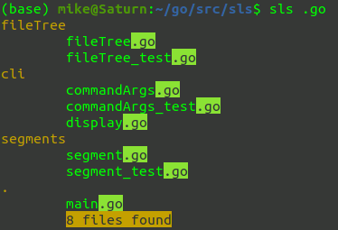

# sls
sls is a command line utility that searches files by name. The results have the matching text highlighted. 
the number of matching files is also displayed

## Usage

`sls [OPTION] [FILTER PATTERN]`

### Command arguments 
|long|short|description|
|----------|----------|----------|
|--path|-p| Directory path to be used as the root of the search. If a path is not specified, the current working directory will be used.|
|--filter|-f|Text used to filter the results. Any string can be used and the command will search for any partial word match. This value can also be provided as a positional argument. The filter matching is not case sensitive. Multiple match strings cab be provided, separated by an astrisk and the strings will be evaluated as an OR.   See examples below. |
|--help|-h|Show the help text|

### Usage examples
`sls`
Executing sls without any command arguments simply lists the files in the current directory without any filter applied. 

`sls .txt`
Search the current directory for file names which contain '.txt'. The filter text is highlighted in the results and the count is provided. 

`sls --path ~/Downloads evernote`
Searches the user's Download folder for any file names containing 'evernote'. The filter text is highlighted in the results and the count is provided.

`sls --path ~/Downloads jpg*jpeg*gif*png`
Searches the user's Download folder for any file names containing 'jpg', 'jpeg', 'gif' or 'png'. The filter text is highlighted in the results and the count is provided.

`sls --help`
Show the help text. 

